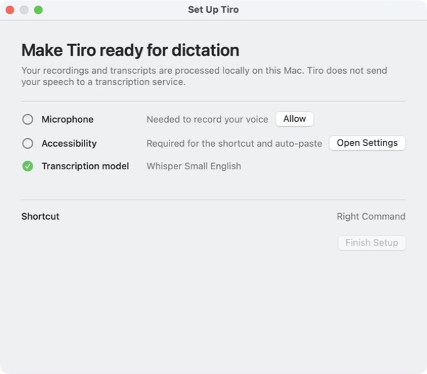
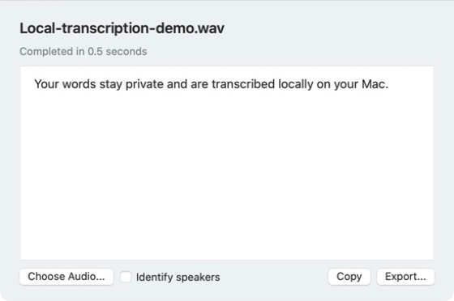
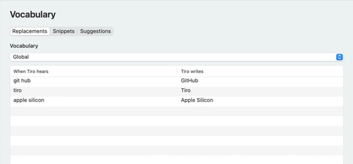
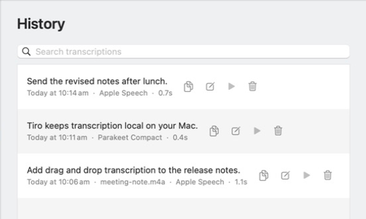
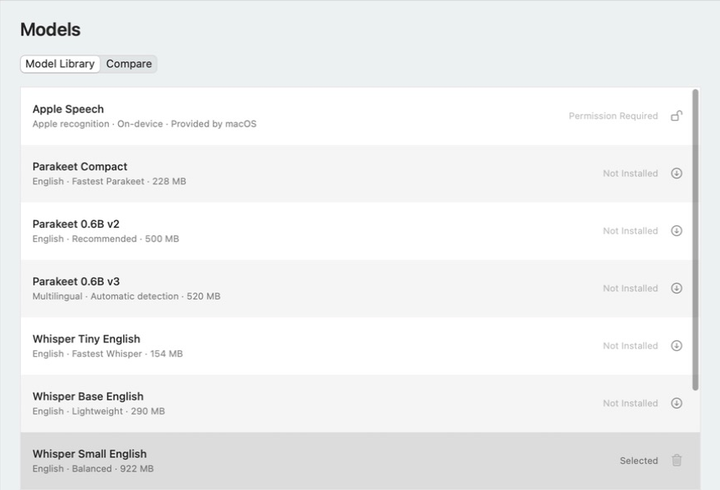

# Tiro

<p align="center"><strong>Private, fast speech-to-text for Apple Silicon Macs.</strong></p>

<p align="center">
  <a href="https://github.com/hughleat/tiro/releases">Download Tiro</a>
  · <a href="#install">Install</a>
  · <a href="#command-line">Command line</a>
  · <a href="LICENSE">MIT License</a>
</p>

Tiro records from the menu bar, transcribes entirely on your Mac, copies the
result, and can paste it directly into the application you were using. It is
free, open source, and built natively for macOS.

<p align="center">
  
  <br><sub>Record from any application, then copy or paste the local transcript automatically.</sub>
</p>

## Why Tiro

- **Local by default.** Recordings and transcripts are not sent to a transcription service.
- **Natural controls.** Tap Right Command to start and stop, hold it for push-to-talk, or press Escape to cancel.
- **Automatic delivery.** Tiro copies every result and can paste it into the active application.
- **Your choice of model.** Use Parakeet, Whisper, or Apple's on-device speech recognizer.
- **Useful beyond dictation.** Transcribe dropped audio files, identify speakers, export subtitles, or use the command line.

## Install

Tiro supports macOS 14 Sonoma or later. Download the latest DMG from
[GitHub Releases](https://github.com/hughleat/tiro/releases), open it, and drag
Tiro to Applications.

Community builds are ad-hoc signed rather than Apple-notarized. The first time
you open each downloaded version, macOS will block it:

1. Try to open Tiro from Applications.
2. Open **System Settings > Privacy & Security**.
3. Choose **Open Anyway**, then confirm **Open**.

During setup, grant Microphone access for recording and Accessibility access
for the global shortcut and automatic paste. Speech Recognition access is
needed only when Apple Speech is selected.

Models are never bundled with the app. Tiro downloads only models selected by
the user, and all transcription remains local. Apple Speech uses macOS-managed
on-device recognition and language data.

<p align="center">
  
</p>

## Controls

- Tap the configured shortcut, Right Command by default, to start or stop.
- Hold the shortcut for push-to-talk.
- Press Escape to cancel.
- Use the waveform menu-bar icon for recording, models, settings, and history.
- Choose **Transcribe Audio File...** or drop an audio file into its window.

Tiro also includes searchable history, optional retained audio, global and
per-app vocabulary, learned vocabulary suggestions, reusable snippets, spoken
formatting, privacy controls, and side-by-side model comparison.

<p align="center">
  
  <br><sub>Transcribe existing audio and optionally identify speakers.</sub>
</p>

<p align="center">
  
  <br><sub>Teach Tiro names, product terms, and other custom spellings.</sub>
</p>

<p align="center">
  
  <br><sub>Search, copy, correct, replay, or remove locally stored transcriptions.</sub>
</p>

Speaker identification is optional and currently available for imported files
whose transcription model supplies timestamps. Its additional local Core ML
model is installed separately from **Settings > Models**.

## Command Line

Settings > General includes **Install Command-Line Tool...**, which links the
small bundled helper at `/usr/local/bin/tiro`. The app remains responsible for
recording, model loading, transcription, history, and the clipboard, so the
command does not load a second copy of a model.

```sh
tiro transcribe meeting.m4a
tiro transcribe interview.m4a --diarize
tiro diarize interview.m4a --json
tiro transcribe meeting.m4a --copy --json
tiro record --copy
session="$(tiro record start)"
tiro record stop "$session" --copy
tiro status --json
tiro models
```

Use `--no-history` on `transcribe`, `diarize`, or `record start` for one-off
work. Plain output contains only the transcript. JSON transcription output also
contains timestamped segments and, when diarisation is enabled, speaker IDs.
Interactive `tiro record` records until Control-D, then transcribes; Control-C
cancels and discards it. Tiro also cancels the recording if the terminal
process exits unexpectedly. Diagnostics use standard error output.

## Models

Tiro offers Apple Speech and native Core ML models through FluidAudio and
WhisperKit. A few useful starting points:

| Need | Suggested model |
| --- | --- |
| Recommended English accuracy | Parakeet 0.6B v2 |
| Fast, compact English dictation | Parakeet Compact |
| High-accuracy multilingual transcription | Whisper Large V3 |
| Faster multilingual transcription | Whisper Large V3 Turbo |
| No Tiro-managed model download | Apple Speech |

<p align="center">
  
  <br><sub>Install only the local models you want and switch between them at any time.</sub>
</p>

Tiny, Base, Small, Distil Whisper Large V3, and multilingual Parakeet v3 are
also available. The comparison view can run the same recording through several
installed models.

English-only Parakeet models keep the language fixed to English. Parakeet v3
detects its supported languages automatically. Whisper supports automatic
detection or an explicit language choice. Apple Speech uses the selected
language, with Auto following the Mac's current locale. Tiro supplies up to 100
saved vocabulary terms as recognition hints to Apple Speech.

Downloaded models live under:

```text
~/Library/Application Support/Tiro/Models/coreml/
```

History, recordings, vocabulary, snippets, and privacy settings live under:

```text
~/Library/Application Support/Tiro/data/
```

Private data directories use owner-only permissions. Tiro can copy user data
from old checkout-local `data/` directories without overwriting or deleting
the source.

## Development

Tiro is a Swift Package and has no Python runtime or MLX dependency.

```sh
./scripts/test_all.sh
open "dist/Tiro.app"
```

The complete check runs Swift tests, focused native assertions, a production
Core ML transcription, and mounted DMG verification. Local builds use the
`Tiro Local Development` signing identity when available:

```sh
./scripts/setup_local_signing.sh
./scripts/build_native_app.sh development
```

Create the free GitHub release artifact with:

```sh
./scripts/build_native_app.sh dmg
```

Models are downloaded by the app and are not part of the app or DMG. See
[`docs/RELEASING.md`](docs/RELEASING.md) for signed and notarized builds.

Pushing a version tag such as `v0.1.0-beta.1` runs the complete acceptance
suite and publishes the verified community DMG and SHA-256 checksum as a
GitHub prerelease.

## Optional sponsorship UI

Support links and reminders are compiled out by default. Maintainer builds can
include them explicitly with:

```sh
./scripts/build_native_app.sh development --enable-sponsorship
```

Sponsorship never unlocks features or changes how Tiro works. Tiro sends no
usage telemetry.

## License

Tiro is available under the [MIT License](LICENSE). Dependency and model
attributions are listed in [Third-Party Notices](THIRD_PARTY_NOTICES.md).
