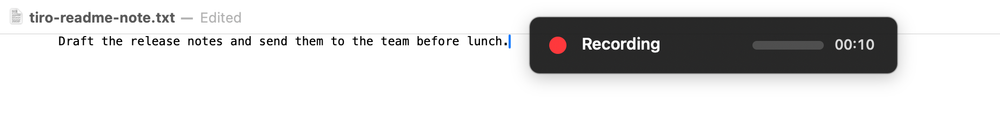

<p align="center">
  
</p>

<h1 align="center">Tiro</h1>

<p align="center"><strong>Private, fast speech-to-text for Apple Silicon Macs.</strong></p>

<p align="center">
  <strong><a href="https://github.com/hughleat/tiro/releases/download/v0.1.0-beta.4/Tiro-0.1.0-beta.4-4-macOS-arm64.dmg">Download Tiro Public Beta (.dmg, 6.1 MB)</a></strong>
  · <a href="#install">Install</a>
  · <a href="#your-first-dictation">First dictation</a>
  · <a href="https://github.com/hughleat/tiro/issues/new/choose">Feedback</a>
  · <a href="LICENSE">MIT License</a>
</p>

<p align="center"><sub>M1 or newer · macOS 14 Sonoma or later · no account · works offline</sub></p>

Tiro is a native menu-bar app that records your voice, transcribes it entirely
on your Mac, and automatically pastes the result when the destination accepts
it. If pasting fails, the transcript remains on the clipboard. Tiro is free and
open source.

<p align="center">
  
  <br><sub>Tiro records first, then transcribes and attempts to paste after you stop. It does not type live.</sub>
</p>

## Install

**Before downloading:** the current beta requires macOS Accessibility access
for its global shortcut and paste workflow. The table below explains exactly
how Tiro uses this broad permission.

1. [Download beta 4](https://github.com/hughleat/tiro/releases/download/v0.1.0-beta.4/Tiro-0.1.0-beta.4-4-macOS-arm64.dmg), open the DMG, and drag Tiro to Applications.
2. Try to open Tiro. When macOS shows its unidentified-developer warning, open **System Settings > Privacy & Security**, choose **Open Anyway**, then confirm **Open**.
3. In Tiro's setup, allow the required permissions and select **Fast English — Parakeet Compact**. Choose **Download**, wait for it to finish, try a dictation in the setup field, then select **Start Using Tiro**.

The DMG is 6.1 MB and the installed app is about 14 MB. Speech models are not
bundled: Parakeet Compact is a separate 228 MB download, and Tiro downloads
only models you explicitly choose. Once a model is installed, dictation works
without an internet connection.

<p align="center">
  
</p>

### Permissions

| Permission | Why Tiro needs it | When it is needed |
| --- | --- | --- |
| **Microphone** | Records the speech you ask Tiro to transcribe. | Required by the current setup. |
| **Accessibility** | Detects the global shortcut, attempts to restore the original app, refuses to auto-paste into secure fields, and sends Paste. To confirm the paste, Tiro may briefly read the focused field's selected range, text, or character count in memory; it does not save or transmit that information. | Required by the current setup for the global shortcut and automatic paste. |
| **Speech Recognition** | Lets macOS perform on-device recognition. | Only when you select Apple Speech. |

Accessibility is a broad macOS permission, even though Tiro uses it for this
narrow workflow. Temporary microphone files are normally deleted when an
operation finishes; leftovers from a crash or forced quit are removed the next
time Tiro launches. **Keep recordings** is off on new installations.

### Why macOS warns

The free community DMG does not use Apple's paid Developer ID and notarization
service, so macOS asks you to approve each downloaded version once. This is the
standard unidentified-developer warning, not a malware finding. Tiro's source,
[release workflow](.github/workflows/release.yml), and build instructions are
public, and every release includes a SHA-256 checksum.

Tiro is an independent project maintained by
[Hugh Leather](https://github.com/hughleat). It is currently a public beta:
dictation is working, but bugs and application compatibility problems are still
possible. Keep the original audio for an important imported recording and
[report anything surprising](https://github.com/hughleat/tiro/issues/new/choose).
Only the [latest published beta](https://github.com/hughleat/tiro/releases)
receives security fixes.

<details>
<summary>Verify the downloaded DMG (optional)</summary>

Download the `.sha256` file beside the DMG on the
[release page](https://github.com/hughleat/tiro/releases/tag/v0.1.0-beta.4), then
run:

```sh
shasum -a 256 ~/Downloads/Tiro-0.1.0-beta.4-4-macOS-arm64.dmg
```

The long value printed by `shasum` should match the value in the `.sha256`
file. This confirms that your download matches the file published by the
project.
</details>

## Your First Dictation

1. Open TextEdit, Notes, Mail, or another application and place the cursor in a normal text field.
2. Tap Right Command. Tiro's red recording panel appears.
3. Speak, then tap Right Command again.
4. Tiro shows **Transcribing**, then attempts to restore the original application and paste at the cursor.

Text appears after recording stops; live transcription is not currently part
of Tiro. Hold Right Command instead for push-to-talk, releasing it when you
finish. Press Escape to cancel without transcribing.

Tiro stays in the menu bar and has no Dock icon. Its waveform menu lets you
record, change models, open Settings, or quit. You can change the shortcut and
turn off **Paste after transcription** in **Settings > General**. A completed
transcript is still copied to the clipboard if automatic paste fails.

## Privacy

- **Local transcription:** Parakeet and Whisper run on your Mac. Tiro requires Apple Speech to use its on-device mode; if that mode is unavailable for a language, Tiro will not use Apple Speech for it.
- **Temporary audio:** Microphone files are normally deleted when transcription ends unless **Keep recordings** is enabled. Interrupted-run leftovers are removed at the next launch.
- **History off by default:** Tiro does not save transcript history or recordings on a new installation. If enabled, retention defaults to 30 days and can be set to 1, 7, 30, or 90 days, or forever, in **Settings > Privacy**. Retained audio can consume substantial disk space.
- **Clipboard:** Successful auto-paste temporarily uses the clipboard, then restores its previous contents when Tiro can confirm the paste and the clipboard has not changed meanwhile. If auto-paste is off or fails, the transcript stays on the clipboard and may be available to other software or macOS Universal Clipboard.
- **No tracking:** Tiro has no accounts, telemetry, advertising, or built-in crash reporting.
- **Limited network use:** Tiro connects only when you request a model download or choose **Settings > About > Check for Updates**.

Parakeet and speaker-identification models are fetched from public Hugging Face
repositories through FluidAudio; Whisper models come from Argmax's public
WhisperKit repository on Hugging Face. Those services receive ordinary
connection information such as your IP address during a download. Speech and
transcripts are not uploaded with the request. After downloading, Tiro checks
that the expected model components are present before activating the model; it
does not publish independent checksums for upstream model files.

Downloaded models live in `~/Library/Application Support/Tiro/Models/coreml/`.
History, optional recordings, vocabulary, snippets, and privacy settings live
in `~/Library/Application Support/Tiro/data/`. Tiro's diagnostics report
excludes transcripts, audio, clipboard contents, vocabulary, file paths, and
application names.

## Models

| Need | Suggested model | Download |
| --- | --- | ---: |
| Fast everyday English | Parakeet Compact | 228 MB |
| Larger English Parakeet | Parakeet 0.6B v2 | 500 MB |
| 25 European languages | Parakeet 0.6B v3 | 520 MB |
| No Tiro-managed download | Apple Speech | None |

For everyday English, start with Compact; v2 provides the larger English-only
Parakeet model. Choose v3 for automatic detection across its
[supported European languages](https://github.com/FluidInference/FluidAudio/blob/main/Documentation/ASR/GettingStarted.md).
Apple Speech avoids a Tiro-managed model download but requires macOS Speech
Recognition permission and on-device support for the selected language.

Depending on your Mac, Tiro also offers English and multilingual Whisper Tiny,
Base, and Small models, plus Distil Whisper Large V3, Whisper Large V3, and
Whisper Large V3 Turbo. Install, compare, and remove models in **Settings >
Models**.

<p align="center">
  
  <br><sub>The library shows each model's download size and installation state; the selected model can be changed at any time.</sub>
</p>

## Do More

Choose **Transcribe Audio File...** from the waveform menu or drop an audio
file into the transcription window. Tiro can export text, Markdown, and JSON,
plus SRT and VTT when timestamps are available. Speaker identification requires
a timestamp-capable speech model and the separately installed **Speaker
Identification** model.

<p align="center">
  
  <br><sub>Transcribe existing audio and optionally identify speakers.</sub>
</p>

Vocabulary rules fix names and specialist terms automatically. Tiro also
supports reusable snippets, spoken formatting, learned suggestions, and
different vocabulary for individual applications.

<p align="center">
  
  <br><sub>Teach Tiro names, product terms, and other custom spellings.</sub>
</p>

Turn on **Save transcription history** in **Settings > Privacy** to search,
copy, correct, or delete previous results. Enable **Keep recordings** as well
for replay and model comparison.

<p align="center">
  
  <br><sub>Your optional transcription history stays on your Mac.</sub>
</p>

## Remove Tiro

1. If installed, remove the command-line link with **Settings > General > Command Line > Uninstall**.
2. Turn off **Launch Tiro at login** in **Settings > General**.
3. Choose **Quit Tiro** from its waveform menu, then move Tiro from Applications to the Trash.
4. To remove downloaded models and personal data, open Finder's **Go > Go to Folder...** and delete `~/Library/Application Support/Tiro`.
5. Turn off Tiro's Microphone, Accessibility, and Speech Recognition access in **System Settings > Privacy & Security**.

For a completely clean removal, you can also delete
`~/Library/Preferences/local.tiro.dictation.plist` and
`~/Library/Caches/Tiro`.

## More

- [Use Tiro from the command line](docs/COMMAND_LINE.md)
- [Build Tiro from source](docs/DEVELOPMENT.md)
- [Read the beta testing guide](docs/BETA_TESTING.md)
- [Report a bug or suggest an improvement](https://github.com/hughleat/tiro/issues/new/choose)
- [Report a security problem privately](SECURITY.md)

## License

Tiro is available under the [MIT License](LICENSE). Dependency and model
attributions are listed in [Third-Party Notices](THIRD_PARTY_NOTICES.md).
